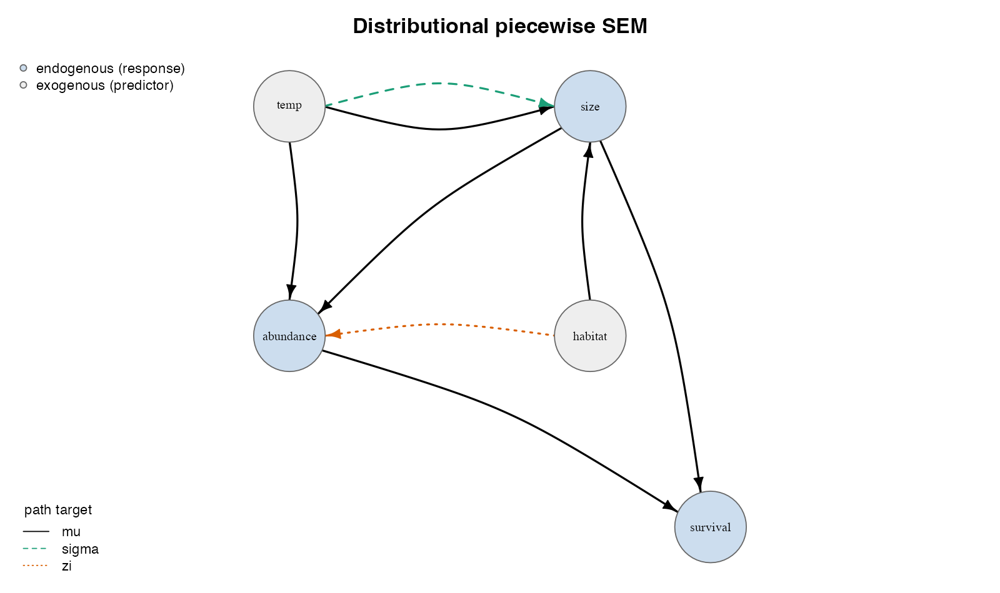

# drmSEM

<!-- badges: start -->
[](https://github.com/itchyshin/drmSEM/actions/workflows/R-CMD-check.yaml)
[](https://lifecycle.r-lib.org/articles/stages.html#experimental)
[](https://www.gnu.org/licenses/gpl-3.0)
<!-- badges: end -->

📖 **Documentation & articles:** <https://itchyshin.github.io/drmSEM>

The `drmSEM` package is a distributional piecewise SEM framework built on
[`drmTMB`](https://github.com/itchyshin/drmTMB), where causal paths can target
not only the expected response but also scale, shape, zero-inflation, hurdle
probability, random-effect scale, and residual correlation.

> Status: early / experimental (version 0.5.0). See [Status](#status).



## Installation

`drmSEM` is built on the `drmTMB` fitting engine, which compiles `TMB` (C++)
from source, so you need a working C++ toolchain (Rtools on Windows, Xcode
command-line tools on macOS, a standard build toolchain on Linux). Install the
engine first, then `drmSEM`:

```r
# install.packages("pak")
pak::pak("itchyshin/drmTMB")
pak::pak("itchyshin/drmSEM")
```

Or with remotes:

```r
# install.packages("remotes")
remotes::install_github("itchyshin/drmTMB")
remotes::install_github("itchyshin/drmSEM")
```

## Why drmSEM

**Engine / layer split.** `drmTMB` is the *fitting engine*; `drmSEM` is the
*SEM layer* on top of it. `drmSEM` never fits its own likelihoods. Each
endogenous node is one `drmTMB` fit, the system is **piecewise**, and the graph
must be a **DAG**.

**Component-labelled paths.** A causal path does not have to point at the mean.
It can target any modelled distributional component of a node:
`mu`, `sigma`, `nu`, `zi`, `hu`, `sd(group)`, or `rho12` (the residual
correlation between the two responses of a bivariate node, i.e.
`eps_y1 <-> eps_y2` — not a directed `y1 -> y2` path). For example,
temperature can act on abundance through several distinct channels:

- `temp -> mu(abundance)` — temperature shifts the *expected* abundance.
- `temp -> sigma(abundance)` — temperature changes the *dispersion / scale*, not
  the mean.
- `temp -> zi(abundance)` — temperature changes the *probability of structural
  zeros*, not the conditional mean.

These are different scientific claims, and `drmSEM` keeps them distinct
everywhere: a path to `sigma` or `zi` is never reported as a mean effect.

**Honest effects.** Indirect and total effects are computed by **Monte-Carlo
g-computation** over the fitted DAG (mean-mediated vs distribution-mediated),
never by multiplying coefficients — coefficient products are invalid across
non-Gaussian links and across distributional components. Effects are reported on
the conditional (typical-group, random-effects-at-zero) response scale. The
default `direct` is a *controlled* direct effect; the mean/distribution split is
an interventional decomposition (the distribution-mediated row is a Jensen-gap
term — Pearl; Imai et al.; VanderWeele), not a cross-world natural decomposition
unless the outcome is linear with no exposure–mediator interaction (use
`effect = "natural"` for that).

**Compared to existing tools.** `lavaan` does latent-variable Gaussian SEM;
`piecewiseSEM` does piecewise SEM but works on the mean only; `glmmTMB` fits
rich distributional GLMMs but is not an SEM; `dsem` does dynamic SEM. `drmSEM`
is the piece that lets a piecewise SEM address scale, shape, zero-inflation,
hurdle, random-effect scale, and residual correlation as first-class causal
targets.

## Quick start

**The question.** Suppose body `size`, local `abundance`, and `survival` form a
chain, and you want to know: *does temperature reach survival only by shifting
the average size and abundance, or also by changing how* variable *size is and
how often abundance collapses to zero?* A mean-only SEM cannot even ask the
second half of that question. `drmSEM` can, because a path can target a
non-mean component.

The canonical example below encodes that chain: `size -> abundance -> survival`,
with `temp` acting on the `sigma` (scale) of size and `habitat` on the `zi`
(zero-inflation) of abundance. This block is illustrative and not executed here;
the [`drmSEM` intro vignette](https://itchyshin.github.io/drmSEM/articles/drmSEM.html)
runs the same chain end to end with simulated data.

```r
library(drmSEM)

sem <- drm_sem(
  size      = drm_node(drmTMB::bf(size ~ temp + habitat, sigma ~ temp),
                       family = stats::gaussian()),
  abundance = drm_node(drmTMB::bf(abundance ~ size + temp, zi ~ habitat),
                       family = drmTMB::nbinom2()),
  survival  = drm_node(drmTMB::bf(cbind(alive, dead) ~ abundance + size),
                       family = drmTMB::beta_binomial()),
  data = dat
)

paths(sem)        # component-labelled path table
basis_set(sem)    # independence claims implied by the DAG
dsep(sem)         # any-component LRT for each claim
fisher_c(sem)     # Fisher's C goodness-of-fit for the SEM

# Effects of temperature on survival, propagated through the fitted DAG
direct_effects(sem,   from = "temp", to = "survival")
indirect_effects(sem, from = "temp", to = "survival")
total_effects(sem,    from = "temp", to = "survival", method = "simulate")

plot(sem)         # DAG with component-labelled edges
```

**Reading the output.** `indirect_effects()` returns one row per `quantity`,
each an effect on the response (here, probability) scale:

- `total_path` — the full effect of `temp` on `survival` through the chain;
- `direct` — the controlled direct effect (mediators held fixed);
- `indirect` — `total_path - direct`;
- `mean_mediated` — the part carried by mediator *means*;
- `distribution_mediated` — the *extra* part that appears only when mediators
  pass realized draws, i.e. signal flowing through their `sigma`, `zi`, or `nu`
  (`indirect ≈ mean_mediated + distribution_mediated`).

The `distribution_mediated` row is the answer to the second half of our
question: if it is clearly non-zero, temperature reaches survival partly by
changing the *spread* of size and the *zeros* of abundance, not only their
means. A mean-only SEM would report that channel as zero or fold it silently
into the mean; `drmSEM` keeps it visible and correctly labelled. (Effects are
computed by Monte-Carlo g-computation, so honest numbers require the fitted
engine — see the vignette for a worked run.)

## More

- **Model selection.** Define a candidate set with `drm_dag()` /
  `drm_model_set()`, then `compare()` / `best()` / `average()` to rank and
  model-average competing DAGs. See `vignette("comparison")`.
- **Covariance edges & composites.** Declare residual / random-effect covariance
  edges with `covary()` (reported by `covariances()`, respected by `dsep()`), and
  build composite (formative / PCA) constructs with `drm_composite()` /
  `loadings()`. See `vignette("covariance-edges-and-composites")` and
  `vignette("latent-variables")`.
- **Bivariate nodes.** `drm_pair()` declares a joint two-response node with a
  residual `rho12` (and higher-level `corpair`) correlation; `rho12()` /
  `corpairs()` report the declared edges and `plot(show = "all")` draws them as
  double-headed / dashed arcs. The correlation *estimates* await the joint
  bivariate fit (an engine step), so they are reported as `NA`, never fabricated.
  See `vignette("bivariate-nodes")`.
- **Feedback / cyclic models.** Declare a reciprocal motif with `drm_cycle()` /
  `feedback =` (undeclared cycles stay an error); `total_effects()` then reports
  the system's **equilibrium** effect by fixed-point propagation (`NA` if it
  diverges). Node-wise fitting of a cycle is inconsistent under simultaneity —
  drmSEM warns and never fakes consistency. See `vignette("feedback-cycles")`.
- **Interoperability.** `as_lavaan()` / `from_lavaan()` exchange the graph with
  lavaan model syntax (non-mean distributional paths are dropped *with notice*,
  never misrepresented), and `as_dot()` exports a Graphviz diagram. Graph
  interchange only — drmSEM never fits its own likelihoods.
- **Path attribution.** `path_effects()` splits an indirect effect by mediator
  (inclusion / exclusion) and by distributional component (mean / sigma / zi),
  with a cross-world natural variant and recanting-witness flag.
- **Phylogenetic SEM.** Build an evolutionary relatedness matrix with
  `drm_phylo_cov()` and feed it to a node via `relmat()`. See
  `vignette("phylogenetic-sem")`.

## Status

Early and experimental. The kernel logic — d-separation bookkeeping, the
any-component LRT and Fisher's C, and the simulation-based effect calculus — is
validated by recovery tests that run without the engine. The full
`drmTMB`-integration path (fitting nodes end to end) is validated in the
cloud / CI environment where `drmTMB` is compiled and installed. APIs may change
before a stable release.

## License

GPL (>= 3).
