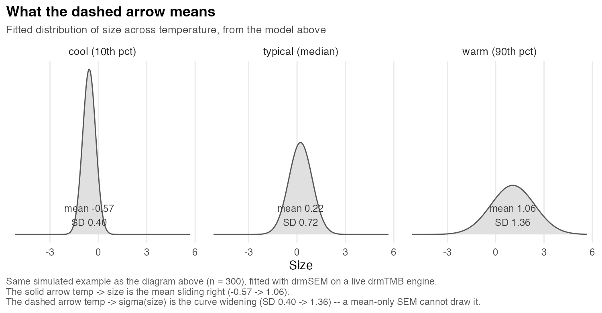

# drmSEM

<!-- badges: start -->
[](https://github.com/itchyshin/drmSEM/actions/workflows/R-CMD-check.yaml)
[](https://lifecycle.r-lib.org/articles/stages.html#experimental)
[](https://www.gnu.org/licenses/gpl-3.0)
<!-- badges: end -->

📖 **Documentation & articles:** <https://itchyshin.github.io/drmSEM/>

The `drmSEM` package is a distributional piecewise SEM framework built on
[`drmTMB`](https://github.com/itchyshin/drmTMB), where causal paths can target
not only the expected response but also scale, shape, zero-inflation, hurdle
probability, random-effect scale, and residual correlation.

> Status: early / experimental (version 0.5.0). See [Status](#status).


`temp` reaches `size` **twice** — a solid arrow into its mean, and a dashed arrow
into its spread. Here is what that second arrow actually does:



As temperature rises, size does not merely get larger — it gets *more variable*
(SD 0.40 → 1.36). A mean-only SEM draws the first arrow and has no way to express
the second. Both figures are the same fitted model.

That is the whole idea. A path may target `sigma`, `nu`, `zi`, `hu`, a random-effect
scale, or a residual correlation, and `paths()` labels every edge by the component
it targets. From there `dsep()` tests independence on *any* component, and
`indirect_effects()` separates the part of an effect carried by a mediator's mean
from the part carried by its distribution. Reproduce both with
`Rscript tools/render-readme-sigma-edge.R`.

## Installation

`drmSEM` is built on the `drmTMB` fitting engine, which compiles `TMB` (C++)
from source, so you need a working C++ toolchain (Rtools on Windows, Xcode
command-line tools on macOS, a standard build toolchain on Linux). Install the
engine first, then `drmSEM`:

```r
# install.packages("pak")
pak::pak("itchyshin/drmTMB")
pak::pak("itchyshin/drmSEM")
```

Or with remotes:

```r
# install.packages("remotes")
remotes::install_github("itchyshin/drmTMB")
remotes::install_github("itchyshin/drmSEM")
```

## Why drmSEM

**Engine / layer split.** `drmTMB` is the *fitting engine*; `drmSEM` is the
*SEM layer* on top of it. `drmSEM` never fits its own likelihoods. Each
endogenous node is one `drmTMB` fit, the system is **piecewise**, and the graph
must be a **DAG**.

**Component-labelled paths.** A causal path does not have to point at the mean.
It can target any modelled distributional component of a node:
`mu`, `sigma`, `nu`, `zi`, `hu`, `sd(group)`, or `rho12` (the residual
correlation between the two responses of a bivariate node, i.e.
`eps_y1 <-> eps_y2` — not a directed `y1 -> y2` path). For example,
temperature can act on abundance through several distinct channels:

- `temp -> mu(abundance)` — temperature shifts the *expected* abundance.
- `temp -> sigma(abundance)` — temperature changes the *dispersion / scale*, not
  the mean.
- `temp -> zi(abundance)` — temperature changes the *probability of structural
  zeros*, not the conditional mean.

These are different scientific claims, and `drmSEM` keeps them distinct
everywhere: a path to `sigma` or `zi` is never reported as a mean effect.

**Honest effects.** Indirect and total effects are computed by **Monte-Carlo
g-computation** over the fitted DAG (mean-mediated vs distribution-mediated),
never by multiplying coefficients — coefficient products are invalid across
non-Gaussian links and across distributional components. Effects are reported on
the conditional (typical-group, random-effects-at-zero) response scale. The
default `direct` is a *controlled* direct effect; the mean/distribution split is
an interventional decomposition (the distribution-mediated row is a Jensen-gap
term — Pearl; Imai et al.; VanderWeele), not a cross-world natural decomposition
unless the outcome is linear with no exposure–mediator interaction (use
`effect = "natural"` for that).

**Compared to existing tools.** `lavaan` does latent-variable Gaussian SEM;
`piecewiseSEM` does piecewise SEM but works on the mean only; `glmmTMB` fits
rich distributional GLMMs but is not an SEM; `dsem` does dynamic SEM. `drmSEM`
is the piece that lets a piecewise SEM address scale, shape, zero-inflation,
hurdle, random-effect scale, and residual correlation as first-class causal
targets. Unmeasured confounding can be *projected* with `latent =` (MAG
m-separation on the observed graph); that is not FIML and not a joint
latent-variable likelihood.

## Quick start

**The question.** Suppose body `size`, local `abundance`, and `survival` form a
chain, and you want to know: *does temperature reach survival only by shifting
the average size and abundance, or also by changing how* variable *size is and
how often abundance collapses to zero?* A mean-only SEM cannot even ask the
second half of that question. `drmSEM` can, because a path can target a
non-mean component.

The canonical example below encodes that chain: `size -> abundance -> survival`,
with `temp` acting on the `sigma` (scale) of size and `habitat` on the `zi`
(zero-inflation) of abundance. This block is illustrative and not executed here;
the [`drmSEM` intro vignette](https://itchyshin.github.io/drmSEM/articles/drmSEM.html)
runs the same chain end to end with simulated data.

```r
library(drmSEM)

sem <- drm_sem(
  size      = drm_node(drmTMB::bf(size ~ temp + habitat, sigma ~ temp),
                       family = stats::gaussian()),
  abundance = drm_node(drmTMB::bf(abundance ~ size + temp, zi ~ habitat),
                       family = drmTMB::nbinom2()),
  survival  = drm_node(drmTMB::bf(cbind(alive, dead) ~ abundance + size),
                       family = drmTMB::beta_binomial()),
  data = dat
)

paths(sem)        # component-labelled path table
basis_set(sem)    # independence claims implied by the DAG
dsep(sem)         # any-component LRT for each claim
fisher_c(sem)     # Fisher's C goodness-of-fit for the SEM

# Effects of temperature on survival, propagated through the fitted DAG
direct_effects(sem,   from = "temp", to = "survival")
indirect_effects(sem, from = "temp", to = "survival")
total_effects(sem,    from = "temp", to = "survival", method = "simulate")

plot(sem)         # DAG with component-labelled edges
```

**Reading the output.** `indirect_effects()` returns one row per `quantity`,
each an effect on the response (here, probability) scale:

- `total_path` — the full effect of `temp` on `survival` through the chain;
- `direct` — the controlled direct effect (mediators held fixed);
- `indirect` — `total_path - direct`;
- `mean_mediated` — the part carried by mediator *means*;
- `distribution_mediated` — the *extra* part that appears only when mediators
  pass realized draws, i.e. signal flowing through their `sigma`, `zi`, or `nu`
  (`indirect ≈ mean_mediated + distribution_mediated`).

The `distribution_mediated` row is the answer to the second half of our
question: if it is clearly non-zero, temperature reaches survival partly by
changing the *spread* of size and the *zeros* of abundance, not only their
means. A mean-only SEM would report that channel as zero or fold it silently
into the mean; `drmSEM` keeps it visible and correctly labelled. (Effects are
computed by Monte-Carlo g-computation, so honest numbers require the fitted
engine — see the vignette for a worked run.)

## More

- **Outcome functionals & tail analytics.** Target causal effects directly on
  non-mean response functionals: exceedance tail risk (`target = "p_gt"`), zero
  probabilities (`target = "p_zero"`), variance (`target = "var"`), or quantiles
  (`target = "quantile"`, `prob = 0.50`), with closed-form analytic forms
  (`functional = "analytic"`) and cross-world natural mediation.
- **Cluster bootstrap & population integration.** Evaluate non-parametric
  parameter uncertainty via full cluster/block refit bootstrap
  (`uncertainty = "bootstrap"`, `R = 500`) and integrate out random effects to
  compute population-averaged marginal effects (`population = "marginal"`) using
  Gauss-Hermite quadrature.
- **Model selection.** Define a candidate set with `drm_dag()` /
  `drm_model_set()`, then `compare()` / `best()` / `average()` to rank and
  model-average competing DAGs by CBIC or CICc. See `vignette("comparison")`.
- **Latent & MIMIC measurement models.** Construct formative, reflective, and
  MIMIC measurement blocks with `drm_latent()` and `drm_indicator()`. Quantify
  construct reliability with Cronbach's $\alpha$ (`drm_cronbach_alpha()`) and
  Raykov's composite $\rho$ (`drm_raykov_rho()`), and separate `loadings(sem)` from
  structural `paths(sem)`. See `vignette("latent-variables")`.
- **Covariance cliques & K >= 3 partitioning.** Declare residual and random-effect
  covariance edges with `covary()` or `covary_clique()`. Bron-Kerbosch maximal
  clique detection (`covariance_cliques()`) automatically suppresses spurious
  within-clique independence claims in `basis_set()` / `dsep()`.
  See `vignette("covariance-edges-and-composites")`.
- **Latent confounding (MAG m-separation).** Name *marginalised* latents with
  `latent =` on `drm_sem()` / `drm_psem()`. `basis_set()` / `dsep()` then test
  m-separation on the implied MAG (Richardson & Spirtes 2002 Cor. 5.3 anteriors;
  empty selection set). This is a graph projection onto a piecewise observed SEM,
  not FIML and not a reflective measurement model. Selection latents are not
  supported. See `docs/design/14-m-separation.md`.
- **Bivariate nodes.** `drm_pair()` declares a joint two-response node with a
  residual `rho12` (and higher-level `corpair`) correlation. `drm_sem()` fits
  **one** bivariate `drmTMB` model; `rho12()` then returns the estimated
  coefficients (intercept and any `rho12 ~ x` predictors) on the `tanh` link.
  An unfitted declaration still reports `NA`, never a fabricated number.
  `plot(show = "all")` draws residual / higher-level edges as double-headed /
  dashed arcs. See `vignette("bivariate-nodes")`.
- **Feedback / cyclic models.** Declare a reciprocal motif with `drm_cycle()` /
  `feedback =` (undeclared cycles stay an error); `total_effects()` then reports
  the system's **equilibrium** effect by multi-component Banach fixed-point
  iteration, audited by spectral radius ($\rho(B) < 1$) and Lipschitz contraction
  diagnostics. Node-wise fitting of a cycle is inconsistent under simultaneity —
  drmSEM warns and never fakes consistency. See `vignette("feedback-cycles")`.
- **Missing data & graph-derived imputation.** Automatically derive missing
  mediator models from the causal DAG with `drm_sem(impute = "auto")`. Supports
  continuous (`gaussian`, `Gamma`, `lognormal`, `student`, `beta`) and discrete
  (`poisson`, `nbinom2`, `ZIP`, `beta_binomial`) families, with multi-parent ($k = 2$) support and
  detailed diagnostics (`imputation()`, `imputed()`). See `vignette("missing-data")`.
- **Symbolic equation rendering.** Walk fitted SEMs in topological order and
  render publication-quality LaTeX equations via `symbolize(sem)` and `as_latex()`
  (integrating with `symbolizer`). See `vignette("equations-via-symbolizer")`.
- **Interoperability.** `as_lavaan()` / `from_lavaan()` exchange the graph with
  lavaan model syntax (non-mean distributional paths are dropped *with notice*,
  never misrepresented), and `as_dot()` exports a Graphviz diagram. Graph
  interchange only — drmSEM never fits its own likelihoods.
- **Path attribution.** `path_effects()` splits an indirect effect by mediator
  (inclusion / exclusion) and by distributional component (mean / sigma / zi),
  with a cross-world natural variant and recanting-witness flag.
- **Phylogenetic SEM.** Build an evolutionary relatedness matrix with
  `drm_phylo_cov()` and feed it to a node via `relmat()`. See
  `vignette("phylogenetic-sem")`.

## Status

Early and experimental. The kernel logic — d-separation bookkeeping, the
any-component LRT and Fisher's C, and the simulation-based effect calculus — is
validated by recovery tests that run without the engine. MAG m-separation under
`latent =` is **partial**: Cor. 5.3 anterior projection with empty selection
set, no selection latents, residual compositional-graphoid question (OQ-16).
The full `drmTMB`-integration path (fitting nodes end to end) is validated in
the cloud / CI environment where `drmTMB` is compiled and installed. APIs may
change before a stable release.

## Methodological background

`drmSEM` builds on a number of distinct literatures and is rigorous about
crediting them at the point of use (see the `@references` blocks on each help
page and the `bibliography:` of each vignette). The canonical entry points are:

- piecewise SEM and local-likelihood d-separation — Shipley (2000, 2009,
  2016) and Lefcheck (2016, `piecewiseSEM`);
- d-separation as a graphical criterion — Pearl (2009);
- ancestral graphs and m-separation — Richardson & Spirtes (2002),
  Sadeghi & Lauritzen (2014), Lauritzen & Sadeghi (2018);
- counterfactual mediation — Pearl (2001), Robins & Greenland (1992),
  Imai et al. (2010), VanderWeele (2014, 2015), Vansteelandt & Daniel (2017);
- distributional regression — Rigby & Stasinopoulos (2005, GAMLSS),
  Brooks et al. (2017, `glmmTMB`);
- phylogenetic comparative methods — Felsenstein (1985), Martins & Hansen
  (1997), Pagel (1999), van der Bijl (2018, `phylopath`), Thorson & van der
  Bijl (2023, `phylosem`);
- information criteria on Fisher's C — Shipley (2013, CICc), Schwarz
  (1978, BIC), Burnham & Anderson (2002).

Three constructions inside the package are explicitly **`drmSEM`
contributions** built on this foundation — the **any-component d-separation
test**, the **distribution-mediated effect row** in `indirect_effects()`, and
the BIC-style **CBIC** information criterion that is now the default in
`compare()`. Each is flagged as such in its help page and the corresponding
vignette, with the underlying components cited.

The bibliography lives in `inst/REFERENCES.bib` (and the JOSS-facing
`paper.bib`); `?drmSEM` lists the principal sources.

## License

GPL (>= 3).
